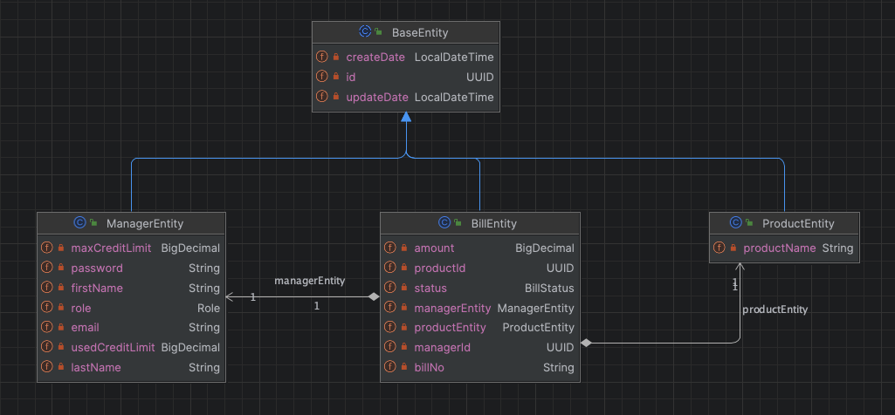

## Account Management Project

**Project Goal**

**You work as a purchasing specialist on an e-commerce platform.**
**Within the scope of this role, you are asked to enter the bills for the products you purchased into the accounting system.**
**When making these entries, the bill amount entered is approved or rejected in accordance with the following rule.**

**Project Tech Stack**
<b>
- Project is written by Java 17 and Spring Boot
- JWT
- MySQL
- Kafka (notification for rejected bills)
- Redis
- Docker (with Volumes)
- Testcontainers
- Open Api
</b>

**Project Tech Stack**
<b>
- DDD with Hexagonal Architecture
</b>

**Endpoints**

There are 4 endpoints in the project.

1. **POST /v1/managers/register** for registering account manager
2. **POST /v1/managers/login** for login account manager
3. **POST /v1/products** for creating product
4. **POST /v1/bills** for creating product's bill by manager
5. **GET /v1/bills** for getting all bills by manager and bill status(approved or rejected) 

**Run with Docker**
- Compile project with Java 17
- Run with Docker commands, go to project folder and run this commands

  ```
    $ cd account-management
    $ docker build -t account-management-image . 
    $ docker-compose -f docker-compose.yaml up -d
  ```
  
**Run with IDE**
- Firstly you must be run mysql, zookeper, kafka and redis in docker
- add your host file
- Run mysql in docker-compose.yaml file and run java project
  ```
    0.0.0.0 account-management-mysql
    0.0.0.0 account-management-zookeeper
    0.0.0.0 account-management-kafka
    0.0.0.0 account-management-redis
    0.0.0.0 account-management
  ```  

**Usage of The Project**
1. **Register with manager info**
2. **Create product**
3. **Create product bill**
4. **Get all product bills by bill status**

1. **Postman Collection is added to doc directory**
2. **Swagger is added**
3. **Curl Commands**

  ```
  curl --location 'http://0.0.0.0:8080/v1/managers/register' \
--header 'Content-Type: application/json' \
--header 'Accept: */*' \
--data '{
  "email": "<string>",
  "firstName": "<string>",
  "lastName": "<string>",
  "password": "<string>"
}'
  ```

  ```
  curl --location 'http://0.0.0.0:8080/v1/managers/login' \
--header 'Content-Type: application/json' \
--header 'Accept: */*' \
--data '{
  "email": "<string>",
  "password": "<string>"
}'
  ```

  ```
  curl --location 'http://0.0.0.0:8080/v1/products' \
--header 'Content-Type: application/json' \
--header 'Accept: */*' \
--header 'Authorization: Bearer {{bearerToken}}' \
--data '{
  "productName": "<string>"
}'
  ```

  ```
  curl --location 'http://0.0.0.0:8080/v1/bills' \
--header 'Content-Type: application/json' \
--header 'Accept: */*' \
--header 'Authorization: Bearer {{bearerToken}}' \
--data '{
  "amount": "<number>",
  "billNo": "<string>",
  "managerId": "<uuid>",
  "productId": "<uuid>"
}'
  ```

  ```
  curl --location 'http://0.0.0.0:8080/v1/bills?managerId=%3Cuuid%3E&status=APPROVED' \
--header 'Accept: */*' \
--header 'Authorization: Bearer {{bearerToken}}'
  ```

**Project have Open Api you can test it in our browser by visiting http://localhost:8080/swagger-ui.html**

***DATABASE***



